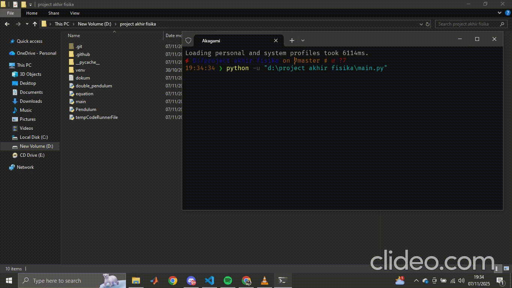

## Double Pendulum


### :computer: intallation

cloe this repository locally to your machine:
```
git clone https://github.com/Ateng-labrador/SFA60202-PEMROGRAMAN-KOMPUTER.git

```
Run code in `main.py`

### :spider_web: Library

* [numpy](https://numpy.org/)
* [pandas](https://pandas.pydata.org/)
* [matplotlib](https://matplotlib.org/)
* [scipy](https://scipy.org/)

### :book: Reprece

* Repo [chris-greening](https://github.com/chris-greening/double-pendula)
* Medium [Double Pendulum Modeling with Numerical Integration](https://medium.com/data-science/simulation-105-double-pendulum-modeling-with-numerical-integration-53189ae63959)
* [wikipedia](https://en.wikipedia.org/wiki/Double_pendulum)
